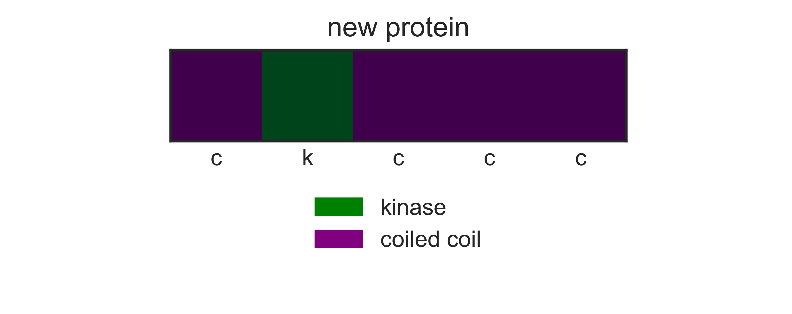
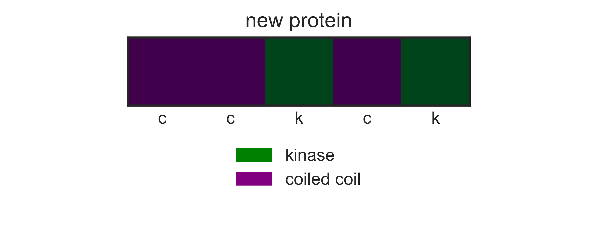
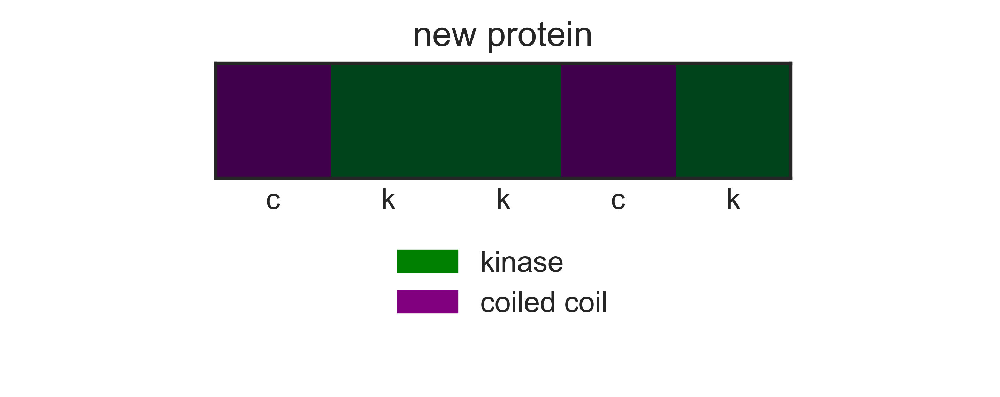
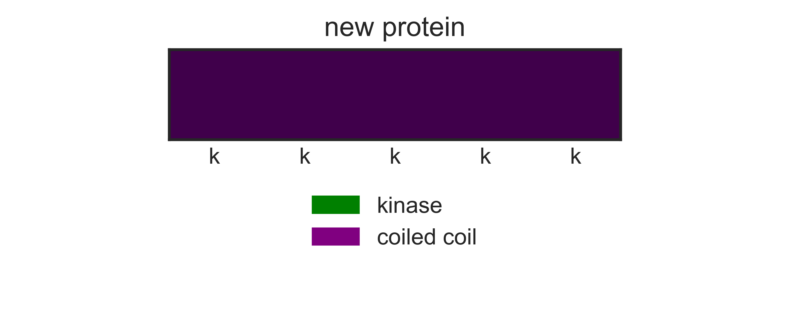
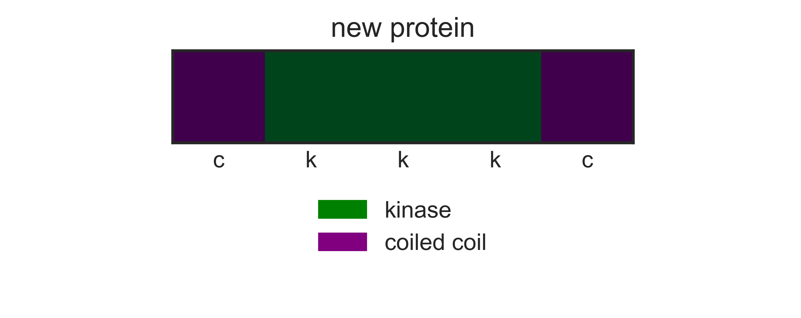

## Shuffling protein domains to make a new protein
### A simulation written for Choate Rosemary Hall 2/2/2018 by R. Antonio Herrera


```python
# imports 

# mathematics package
import numpy as np

# plotting packages and notebook preferences
import matplotlib.pyplot as plt
import matplotlib.patches as mpatches
import seaborn as sn
sn.set_style('white')
%matplotlib inline
```

### This simulation concerns two protein domains shown here; a kinase and a coiled coil.
**Kinase domain structure:**
https://cdn.rcsb.org/images/rutgers/wt/3pp0/3pp0.pdb1-500.jpg


**Coiled coil structure:**
https://cdn.rcsb.org/images/rutgers/wt/1wt6/1wt6.pdb1-500.jpg


### Question: Does the order and arrangement of protein domains impact protein function?

#### Rules: (Arbitrary)
> 1. Flip a coin 10 times, heads is kinase, tails is coiled coil.
> 2. If protein has 2 coiled coils adjacent, then protein can form dimers.
> 3. If protein has a kinase domain, it is only functional if it is flanked by 2 coiled coils that do not make dimers (only 1 on each side).
> 4. Two different proteins can form oligomers and act as kinase only if 2 and 3 are true.

#### Create variables and choose number of domains included in new protein:


```python
domain1 = 'k' # kinase
domain2 = 'c' # coiled coil

domains = [domain1, domain2]

num_domains = 5
```

#### Define a method to flip a coin to choose either domain:


```python
# methods to make a new protein by flipping a coin to choose domains

def coin_flip():
    return np.random.choice([domain1,domain2])

def make_protein(num):
    protein = []
    i=0
    while i < num_domains:
        for motif in np.arange(0,num):
            protein.append(coin_flip())
            i+=1
        return protein
```

#### Execute the coin_fip function and print results:


```python
protein1 = make_protein(num_domains)
print('protein domain order:', protein1)
```

    protein domain order: ['k', 'k', 'c', 'c', 'k']


#### plot domain list as a graph of the protein


```python
# convert kinase to 1 and coil to 0 to plot on graph to visualize the new protein
def analyze_protein(peptide):
    """takes a peptide list and matches either kinase or coiledcoil domain"""
    data = []
    for domain in peptide:
        if domain == 'k':
            data.append(1)
        elif domain == 'c':
            data.append(0)
    return data

def draw_proteins(result):
    """plot the data as an image graph and add a legend"""
    fig = plt.figure(figsize=(5,2), dpi=600)
    ax = fig.add_subplot(2,1,1, aspect='auto')
    plt.title('new protein')
    plt.imshow(np.reshape(result, (len(result),1)).T, interpolation='nearest', cmap='PRGn')
    plt.yticks(visible=False)
    plt.xticks(np.arange(0,num_domains))
    ax.get_xticklabels()
    # ax.grid('True')
    labels = [item.get_text() for item in ax.get_xticklabels()]
    nlabels = [str(x) for x in protein1]
    ax.set_xticklabels(nlabels)
    
    ax2 = fig.add_subplot(2,1,2, aspect='auto')    
    patch1 = mpatches.Patch(color='green', label='kinase')
    patch2 = mpatches.Patch(color='purple', label='coiled coil')
    plt.legend(loc='upper center',handles=[patch1,patch2])
    plt.axis('off')
    plt.tight_layout(h_pad=0, w_pad=0)
    plt.show()
    plt.close()
    return

protein1 = make_protein(num_domains)
result = analyze_protein(protein1)
draw_proteins(result)
protein1 = make_protein(num_domains)
result = analyze_protein(protein1)
draw_proteins(result)
protein1 = make_protein(num_domains)
result = analyze_protein(protein1)
draw_proteins(result)
protein1 = make_protein(num_domains)
result = analyze_protein(protein1)
draw_proteins(result)
protein1 = make_protein(num_domains)
result = analyze_protein(protein1)
draw_proteins(result)
protein1 = make_protein(num_domains)
result = analyze_protein(protein1)
draw_proteins(result)
```
















